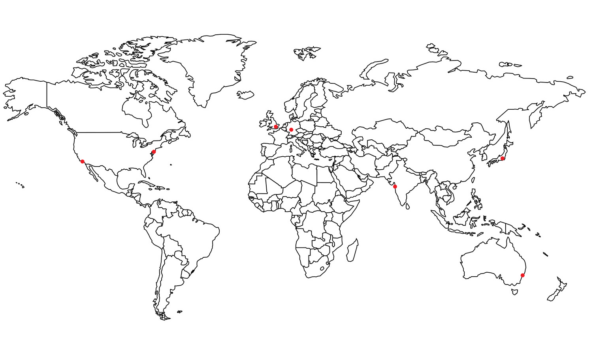

# Google Calendar

## 1. Тема и целевая аудитория

**Google Calendar** — сервис для планирования встреч, событий и дел.

### 1.1. Целевая аудитория

**MAU** = **500** млн. [[1]](https://explodingtopics.com/blog/google-workspace-stats), [[2]](https://zipdo.co/statistics/google-calendar/), [[4]](https://www.patronum.io/key-google-workspace-statistics-for-2023/)

Информация о **DAU** отсутствует, поэтому примем его, равным **500 млн.** пользователей, т.е. `MAU = DAU`, т.к. данный тип сервиса используется для планирования встреч, событий и дел, а также для синхронизации данных на устройствах. [[3]](https://marketsplash.com/google-workspace-statistics/)

### 1.2. Географическое распространение (данные за январь 2024) [[4]](https://www.similarweb.com/website/calendar.google.com/#geography)

| Страна         | Процент пользователей от общего числа, % | Количество, млн. |
| -------------- | :--------------------------------------: | :--------------: |
| США            |                  42,93                   |      214,65      |
| Япония         |                   8,17                   |      4,085       |
| Великобритания |                   3,68                   |       1,84       |
| Канада         |                   3,56                   |       1,78       |
| Франция        |                   3,43                   |      1,715       |
| Другие         |                  38,24                   |      191,2       |

### 1.3. Распространение среди различных возрастных групп (данные за январь 2024) [[4]](https://www.similarweb.com/website/calendar.google.com/#geography)

| Возрастная группа | Процент пользователей от общего числа, % |
| :---------------: | :--------------------------------------: |
|      18 - 24      |                  14,74                   |
|      25 - 34      |                  29,81                   |
|      35 - 44      |                  20,58                   |
|      45 - 54      |                  16,89                   |
|      55 - 64      |                  11,33                   |
|        65+        |                   6,65                   |

### 1.4. MVP

- Регистрация, авторизация;
- Создание, редактирование календарей;
- Каждый календарь можно сделать общедоступным либо предоставить отдельным людям доступ к нему (просмотр или редактирование) через приглашение по электронной почте;
- Уведомления о предстоящих событиях по почте;
- Создание и редактирование событий.

## 2. Расчёт нагрузки

### 2.1. Продуктовые метрики

#### 2.1.1. Хранилище пользователя

- Профиль:
  - email — 255 B [[6]](https://emaillistvalidation.com/blog/demystifying-email-validation-understanding-the-maximum-length-of-email-addresses/#:~:text=Defining%20the%20Maximum%20Length&text=Domain%20Part%3A%20The%20domain%20part,email%20address%20is%20320%20characters.)
  - Хэшированный пароль — 72 B [[7]](https://cheatsheetseries.owasp.org/cheatsheets/Password_Storage_Cheat_Sheet.html)
  - First name + Last name — 100 B [[8]](https://www.geekslop.com/technology-articles/2016/here-are-the-recommended-maximum-data-length-limits-for-common-database-and-programming-fields#:~:text=35%20chars%20(US)%2C-,50%20(other),-Last%20name)
  - Часовой пояс — 12 B (ссылка на часовой пояс в таблице часовых поясов) [[9]](https://www.postgresql.org/docs/8.2/datatype-datetime.html)
  - **Общий размер**: 255 + 72 + 100 + 8 = `435 B`
- Календари:
  - Примем количество личных календарей пользователя, равным 5
  - Название — 128 символов UTF-8 (128 B)
  - Описание — 1024 символа UTF-8 (1024 B)
  - Владелец — 8 B (ссылка на пользователя)
  - Время создания — 12 B
  - Время обновления — 12 B
  - Размер одного календаря: 128 + 1024 + 8 + 12 + 12 = 1184 B
  - **Общий размер**: 5 \* 1184 = 5920 B < `6 KiB` (принимаем размер хранилища в 6 KiB)
- Подписки на календари:
  - Примем число подписок на чужие календари равным 5
  - Календарь — 8 B (ссылка на календарь)
  - Подписчик — 8 B (ссылка на пользователя)
  - **Общий размер**: 5 \* (8 + 8) = `80 B`
- События:
  - Пусть пользователь создаёт в среднем 3 события в день (примем, что при общем числе событий в 1,5 млрд [[3]](https://marketsplash.com/google-workspace-statistics/) и DAU = 500 млн. число событий 1500/500 = 3). События хранятся долговременно
  - Тогда за период в 5 лет у пользователя наберётся в среднем: 3 \* 365 \* 5 = 5475 событий
  - Название — 128 символов UTF-8 (128 B)
  - Описание — 4096 символов UTF-8 (4096 B)
  - Владелец — 8 B (ссылка на пользователя)
  - Календарь — 8 B (ссылка на календарь)
  - Время начала — 12 B
  - Время окончания — 12 B
  - Время создания — 12 B
  - Время обновления — 12 B
  - Размер одного события: 128 + 4096 + 8 + 8 + 12 + 12 + 12 + 12 = 4288 B
  - **Общий размер**: 5475 \* 4288 = 23476800 B < `23.5 MiB` (принимаем размер хранилища в 23.5 MiB)
- Подписки на события
  - Пример среднее число подписок на чужие события за период в 5 лет равным 2000 (5 \* 365 = 1830 и округлим до 2000)
  - Событие — 8B (ссылка на событие)
  - Подписчик — 8B (ссылка на подписчика)
  - **Общий размер**: 2000 \* (8 + 8) = 32000 B < `32 KiB` (принимаем размер хранилища в 32KiB)
- Уведомления
  - Уведомления хранятся в течение 1-го месяца [[10]](https://stackoverflow.com/questions/24138581/what-is-the-maximum-allowed-expiration-time-for-a-google-notification-channel)
  - Примем средее число уведомлений на событие равным 2-м (при создании и начале)
  - За месяц у пользователя происходит 3 \* 30 = 90 своих событий и 5 \* 3 \* 30 = 450 (при 3-х событиях в 5 календарях, на которые пользователь подписан) тех, на которые он подписан
  - Тогда среднее количество уведомлений пользователя за месяц равно 2 \* (90 + 450) = 1060
  - Размер информации уведомления примем ~ 1 KiB
  - **Общий размер**: 1060 \* 1 = 1060 KiB = `1.06 MiB`

Хранилище под события и подписки на события рассчитано на период в 5 лет. Уведомления хранятся в среднем в течение 1-го месяца.

| Тип                   | Хранилище 1-го пользователя |
| --------------------- | :-------------------------: |
| Профиль               |            435 B            |
| Календари             |            6 KiB            |
| Подписки на календари |            80 B             |
| События               |          23.5 MiB           |
| Подписки на события   |           32 KiB            |
| Уведомления           |          1.06 MiB           |

#### 2.1.2 Среднее количество действий пользователя по типам в день

| Тип действия           |  Частота  |
| ---------------------- | :-------: |
| Просмотр календарей    | 15 / день |
| Создание события       | 3 / день  |
| Редактирование события | 1 / 2 дня |
| Получение уведомлений  | 15 / день |

### 2.2 Технические метрики

#### 2.2.1 Размер хранения в разбивке по типам данных

Так как количество зарегистрированных аккаунтов в Google Workspace равно 3 млрд [[1]](https://explodingtopics.com/blog/google-workspace-stats)-[[4]](https://www.patronum.io/key-google-workspace-statistics-for-2023/) и MAU Google Calendar равно 500 млн., то примем количество зарегистрированных пользователей равным 1 млрд.

Уведомления, события и подписки актуальны для активных пользователей, а профиль и календари есть у всех зарегистрированных.

- Округление выполняется в большую сторону
- Профиль: 435 B \* 1 млрд. = `406 GiB`
- Календари: 6 KiB \* 1 млрд. = `5.6 TiB`
- Подписки на календари: 80B \* 500 млн. = `37.3 GiB`
- События: 23.5 MiB \* 500 млн. = `10.95 PiB`
- Подписки на события: 32 KiB \* 500 млн. = `14.9 TiB`
- Уведомления: 1.06 MiB \* 500 млн. = `506 TiB`

| Тип                   | Хранилище 1-го пользователя |
| --------------------- | :-------------------------: |
| События               |          10.95 PiB          |
| Уведомления           |           506 TiB           |
| Подписки на события   |          14.9 TiB           |
| Календари             |           5.6 TiB           |
| Профиль               |           406 GiB           |
| Подписки на календари |          37.3 GiB           |

#### 2.2.1 Сетевой трафик

- Средний RPS будем считать по следующей формуле:
  - _DAU \* количество действий в день \* количество запросов для действия / 86400 сек_
- Суммарный суточный трафик будем считать по следующей формуле:
  - _DAU \* количество действий в день \* количество байт пересылаемых запросами для совершения действия_
- Средний трафик будем считать по следующей формуле:
  - _Суммарный суточный трафик / 86400 сек_

1. Просмотр календарей

   Просмотр календаря включает запрос на получение календарей вместе с событиями и запрос на получение данных пользователя.

   - **Средний RPS**: 500 млн. \* 5 просмотров \* (1 + 1) / 86400 сек = `57871RPS`
     События хранятся месяц, поэтому, в среднем, запрос календаря включает получение 90 событий.
   - **Суммарный суточный трафик**: 500 млн. \* 5 просмотров \* (1184 + 90 \* 4288 + 435) B = `882 TiB/сутки`
   - **Средний трафик**: 882 TiB/сутки / 86400 сек = 10.45 GiB/сек = `83.63 Гбит/сек`

2. Создание события

   - **Средний RPS**: 500 млн. \* 3 создания / 86400 сек = `17362 RPS`
   - **Суммарный суточный трафик**: 500 млн. \* 3 создания \* 4288 B = `5.85TiB/сутки`
   - **Средний трафик**: 5.85TiB/сутки / 86400 сек = 71MiB/сек = `568 Мбит/сек`

3. Редактирование события

   - **Средний RPS**: 500 млн. \* (1 / 2) редактирование \* 1 / 86400 сек = `2894 RPS`
   - **Суммарный суточный трафик**: 500 млн. \* (1 / 2) редактирование \* 1 \* 4288 B = `999.4 GiB/сутки`
   - **Средний трафик**: 999.4 GiB/сутки / 86400 сек = 11.85MiB/сек = `94.8 Мбит/сек`

4. Получение уведомлений
   - **Средний RPS**: 500 млн. \* (3 своих уведомления + 5 уведомлений от подписок) / 86400 сек = `46427 RPS`
   - **Суммарный суточный трафик**: 500 млн. \* (3 своих уведомления + 5 уведомлений от подписок) \* 1024 B = `3.73 TiB/сутки`
   - **Средний трафик**: 3.73 TiB/сутки / 86400 сек = 45.27 MiB/сек = `362.16 Мбит/сек`

Для получения пиковых значений трафика и RPS умножим среднее потребление трафика в два раза (возьмём коэффициент запаса, равный 2-м)

| Действие               |  RPS  | Пиковый RPS | Средний трафик  | Пиковый трафик  | Суммарный суточный трафик |
| ---------------------- | :---: | :---------: | :-------------: | :-------------: | :-----------------------: |
| Просмотр календарей    | 57871 |   115742    | 83.63 Гбит/сек  | 167.26 Гбит/сек |       882 TiB/сутки       |
| Создание события       | 2894  |    5788     |  568 Мбит/сек   |  1.11 Гбит/сек  |      5.85 TiB/сутки       |
| Редактирование события | 17362 |    34726    |  94.8 Мбит/сек  | 189.6 Гбит/сек  |      999.4 GiB/сутки      |
| Редактирование события | 46427 |    92854    | 362.16 Мбит/сек | 724.32 Мбит/сек |      3.73 TiB/сутки       |

## 3. Балансировка нагрузки

### 3.1. Физическое расположение дата-цетров

Для анализа основных регионов потоков трафика были выбраны следующие статистики:

- hypestat.com [[11]](https://hypestat.com/info/calendar.google.com)

  1. USA — 18.8%
  2. India — 10.7%
  3. Japan — 5.2%
  4. Russia — 2.9%
  5. Brazil — 2.8%
  6. Other — 59.6%

- webstatsdomain.org [[12]](https://webstatsdomain.org/d/calendar.google.com)

  1. USA — 32.7%
  2. India — 7.7%
  3. China — 4.4%
  4. Japan — 4.3%
  5. Iran — 3%

- similarweb.com (выбрана для обобщения с остальными статистиками несмотря на неточность) [[5]](https://www.similarweb.com/website/calendar.google.com/#geography)

  1. USA — 42.93%
  2. Japan — 8.17%
  3. United Kingdom — 3.68%
  4. Canada — 3.56%
  5. Brazil — 2.8%
  6. Other — 38.24%

Обобщим эти статистики:

1. USA — 42.93%
2. India — 10.7%
3. Japan — 8.17%
4. United Kingdom — 3.68%
5. Canada — 3.56%
6. Russia — 2.9%
7. Brazil — 2.8%
8. Other — 25.26%

Исходя их этой статистики можно сделать вывод, что основная часть дата-центров должна располаться в США, остальные — региональные. Необходимо учитывать, что основными пользователями сервиса являются офисные работники и студенты, т.е. сосредоточено в городах.

Возможные города распложения дата-центров возьмём из [[13]](https://www.visualcapitalist.com/cp/top-data-center-markets/).

Следовательно, дата-центры будут расположены следующим образом:

- Основные дата-центры в США:
  - Нью-Йорк (Северо-восток)
  - Лос-Анджелес (Юго-запад)
- Дополнительные дата-центры:
  - Индия (Мумбаи)
  - Япония (Токио)
  - Великобритания (Лондон)
  - Германия (Франкфурт)
  - Австралия (Сидней)

#### Карта физического расположения дата-центров

### 3.2 Алгоритм балансировки

- Для глобальной балансировки будет использоваться `Geo-based DNS`, который будет направлять пользователя в ближайший по местоположению дата-центр.

- Для обеспечения лучшего качества для тех регионов, которые наиболее удалены от основных дата центров дополнительно используем `CDN`.

- Также используем `Latency-based DNS`, который будет направлять пользователя в дата-центр, обеспечивающий наименьшую задержку (latency) [[14]](https://tutorialsdojo.com/latency-routing-vs-geoproximity-routing-vs-geolocation-routing/).

Таким образом, схема глобальной балансировки ключает следующее:

1. GeoDNS выбирает ближайшую группу CDN.
2. BGP Anycast до ближайшего CDN.
3. Для ускорения работы и уменьшения задержки CDN кэширует статику.

## Список использованных источников

1. https://explodingtopics.com/blog/google-workspace-stats
2. https://zipdo.co/statistics/google-calendar/
3. https://marketsplash.com/google-workspace-statistics/
4. https://www.patronum.io/key-google-workspace-statistics-for-2023/
5. https://www.similarweb.com/website/calendar.google.com/#geography
6. https://emaillistvalidation.com/blog/demystifying-email-validation-understanding-the-maximum-length-of-email-addresses/#:~:text=Defining%20the%20Maximum%20Length&text=Domain%20Part%3A%20The%20domain%20part,email%20address%20is%20320%20characters.
7. https://cheatsheetseries.owasp.org/cheatsheets/Password_Storage_Cheat_Sheet.html
8. https://www.geekslop.com/technology-articles/2016/here-are-the-recommended-maximum-data-length-limits-for-common-database-and-programming-fields#:~:text=35%20chars%20(US)%2C-,50%20(other),-Last%20name
9. https://www.postgresql.org/docs/8.2/datatype-datetime.html
10. https://stackoverflow.com/questions/24138581/what-is-the-maximum-allowed-expiration-time-for-a-google-notification-channel
11. https://hypestat.com/info/calendar.google.com
12. https://webstatsdomain.org/d/calendar.google.com
13. https://www.visualcapitalist.com/cp/top-data-center-markets/
14. https://tutorialsdojo.com/latency-routing-vs-geoproximity-routing-vs-geolocation-routing/