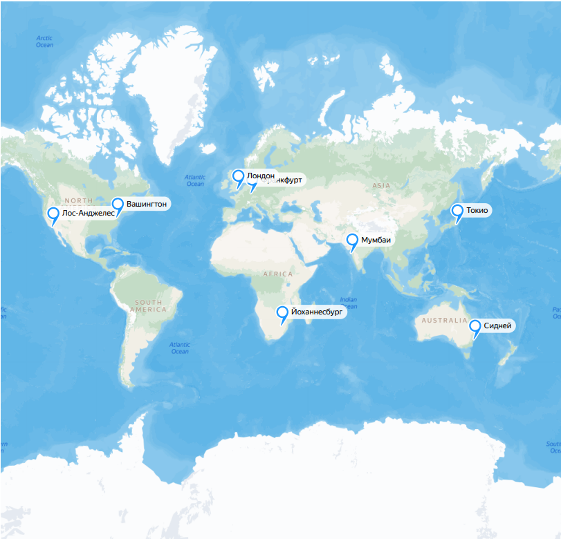

# Google Calendar

## 1. Тема и целевая аудитория

**Google Calendar** — сервис для планирования встреч, событий и дел.

### 1.1. Целевая аудитория

**MAU** = **500** млн. [[1]](https://explodingtopics.com/blog/google-workspace-stats), [[2]](https://zipdo.co/statistics/google-calendar/), [[4]](https://www.patronum.io/key-google-workspace-statistics-for-2023/)

Информация о **DAU** отсутствует, поэтому примем его, равным **500 млн.** пользователей, т.е. `MAU = DAU`, т.к. данный тип сервиса используется для планирования встреч, событий и дел, а также для синхронизации данных на устройствах. [[3]](https://marketsplash.com/google-workspace-statistics/)

### 1.2. Географическое распространение (данные за январь 2024) [[4]](https://www.similarweb.com/website/calendar.google.com/#geography)

| Страна         | Процент пользователей от общего числа, % | Количество, млн. |
| -------------- | :--------------------------------------: | :--------------: |
| США            |                  42,93                   |      214,65      |
| Япония         |                   8,17                   |      4,085       |
| Великобритания |                   3,68                   |       1,84       |
| Канада         |                   3,56                   |       1,78       |
| Франция        |                   3,43                   |      1,715       |
| Другие         |                  38,24                   |      191,2       |

### 1.3. Распространение среди различных возрастных групп (данные за январь 2024) [[4]](https://www.similarweb.com/website/calendar.google.com/#geography)

| Возрастная группа | Процент пользователей от общего числа, % |
| :---------------: | :--------------------------------------: |
|      18 - 24      |                  14,74                   |
|      25 - 34      |                  29,81                   |
|      35 - 44      |                  20,58                   |
|      45 - 54      |                  16,89                   |
|      55 - 64      |                  11,33                   |
|        65+        |                   6,65                   |

### 1.4. MVP

- Регистрация, авторизация;
- Создание, редактирование календарей;
- Каждый календарь можно сделать общедоступным либо предоставить отдельным людям доступ к нему (просмотр или редактирование) через приглашение по электронной почте;
- Уведомления о предстоящих событиях по почте;
- Создание и редактирование событий.

## 2. Расчёт нагрузки

### 2.1. Продуктовые метрики

#### 2.1.1. Хранилище пользователя

Базовый функционал этого приложения включает в себя следующие типы данных:

| Пользователь (профиль) | Календарь       | Приглашённые пользователи | События в календаре | История изменений |
| ---------------------- | --------------- | ------------------------- | ------------------- | ----------------- |
| email                  | Название        | Пользователи              | Дата создания       | Календарь         |
| Хэшированный пароль    | Описание        | Подписки на события       | Дата обновления     | Дата создания     |
| Имя и фамилия          | Дата создания   | Уровень доступа           | Дата начала         | Пользователь      |
| Часовой пояс           | Дата обновления |                           | Дата окончания      |                   |
| Телефонный номер       | Часовой пояс    |                           | Название            |                   |
|                        | Владелец        |                           | Описание            |                   |
|                        |                 |                           | Календарь           |                   |
|                        |                 |                           | Пользователь        |                   |

- В таблице неучтено, что пользователи могут приглашать друг друга в свои календари, поэтому примем число личных календарей, равным `5` и число календарей, в которые пользователь может быть приглашён, равным `10`.
- Число пользователей, которых можно пригласить в календарь примем равным `200` [[14]](https://support.google.com/calendar/answer/37161?hl=en&co=GENIE...&co=GENIE.Platform%3DDesktop#zippy=%2Cguest-limit-for-invitations).
- Число событий, создаваемым пользователем в день примем равным 3 (при общем числе событий в 1,5 млрд [[3]](https://marketsplash.com/google-workspace-statistics/) и DAU = 500 млн. число событий 1500/500 = 3) и хранятся 5 лет, поэтому за 5 лет у пользователя накопится 5 \* 365 \* 3 = `5475`.
- Пусть в истории изменений события хранятся 1 год, поэтому для расчёта её хранилища примем, что все 200 пользователей совершают в среднем одно событие за день в календаре, куда приглашёны, поэтому число событий за 5 лет равно 5 \* 365 \* 1 \* 10 = `54750`.

Далее проведём подробный расчёт с целью выяснение необходимого места для одного пользователя на каждый из этих типов.

#### _Пользователь (профиль)_

| Тип данных          | Размер                                                                                                                                                                                                                                                              |
| ------------------- | ------------------------------------------------------------------------------------------------------------------------------------------------------------------------------------------------------------------------------------------------------------------- |
| email               | 255 B [[6]](https://emaillistvalidation.com/blog/demystifying-email-validation-understanding-the-maximum-length-of-email-addresses/#:~:text=Defining%20the%20Maximum%20Length&text=Domain%20Part%3A%20The%20domain%20part,email%20address%20is%20320%20characters.) |
| Хэшированный пароль | 72 B [[7]](https://cheatsheetseries.owasp.org/cheatsheets/Password_Storage_Cheat_Sheet.html)                                                                                                                                                                        |
| Имя и фамилия       | 100 B [[8]](https://www.geekslop.com/technology-articles/2016/here-are-the-recommended-maximum-data-length-limits-for-common-database-and-programming-fields#:~:text=35%20chars%20(US)%2C-,50%20(other),-Last%20name)                                               |
| Часовой пояс        | 8 B (ссылка)                                                                                                                                                                                                                                                        |
| Телефонный номер    | 15 B [[8]](https://www.geekslop.com/technology-articles/2016/here-are-the-recommended-maximum-data-length-limits-for-common-database-and-programming-fields#:~:text=35%20chars%20(US),-,50%20(other),-Last%20name)                                                  |
| Страна              | 55 B [[8]](https://www.geekslop.com/technology-articles/2016/here-are-the-recommended-maximum-data-length-limits-for-common-database-and-programming-fields#:~:text=35%20chars%20(US)%2C-,50%20(other),-Last%20name)                                                |
| Город               | 50 B [[8]](https://www.geekslop.com/technology-articles/2016/here-are-the-recommended-maximum-data-length-limits-for-common-database-and-programming-fields#:~:text=35%20chars%20(US)%2C-,50%20(other),-Last%20name)                                                |
| **Общий размер**    | 255 + 72 + 100 + 8 + 15 + 55 + 50 = `555 B`                                                                                                                                                                                                                         |

##### _Календарь_

| Тип данных        | Размер                                                                            |
| ----------------- | --------------------------------------------------------------------------------- |
| Название          | 128 символов UTF-8 (128 B)                                                        |
| Описание          | 1024 символа UTF-8 (1024 B)                                                       |
| Дата создания     | 12 B [[9]](https://www.postgresql.org/docs/8.2/datatype-datetime.html)            |
| Дата обновления   | 12 B [[9]](https://www.postgresql.org/docs/8.2/datatype-datetime.html)            |
| Часовой пояс      | 8 B (ссылка)                                                                      |
| Владелец (ссылка) | 8 B                                                                               |
| **Общий размер**  | 5 \* (128 + 1024 + 8 + 12 + 12 ) = 5 \* 1184 = 5920 B < `6 KiB` (принимаем 6 KiB) |

##### _Приглашённые пользователи_

| Тип данных                | Размер                                                                        |
| ------------------------- | ----------------------------------------------------------------------------- |
| Приглашённые пользователи | 200 \* 8 = 1600 B (ссылки)                                                    |
| Подписка на события       | 200 \* 1 = 200 B                                                              |
| Уровень доступа           | 200 \* 8 = 1600 B (ссылка на перечень прав)                                   |
| **Общий размер**          | 5 \* (1600 + 200 + 1600 ) = 5 \* 3400 = 17000 B < `17 KiB` (принимаем 17 KiB) |

##### _События_

| Тип данных       | Размер                                                                                                      |
| ---------------- | ----------------------------------------------------------------------------------------------------------- |
| Дата создания    | 12 B [[9]](https://www.postgresql.org/docs/8.2/datatype-datetime.html)                                      |
| Дата обновления  | 12 B [[9]](https://www.postgresql.org/docs/8.2/datatype-datetime.html)                                      |
| Дата начала      | 12 B [[9]](https://www.postgresql.org/docs/8.2/datatype-datetime.html)                                      |
| Дата окончания   | 12 B [[9]](https://www.postgresql.org/docs/8.2/datatype-datetime.html)                                      |
| Название         | 128 символов UTF-8 (128 B)                                                                                  |
| Описание         | 1024 символа UTF-8 (1024 B)                                                                                 |
| Календарь        | 8 B (ссылка)                                                                                                |
| Пользователь     | 8 B (ссылка)                                                                                                |
| **Общий размер** | 5475 \* (12 + 12 + 12 + 12 + 128 + 1024 + 8 + 8) = 5475 \* 1216 = 6657600 B < `6.7 MiB` (принимаем 6.7 MiB) |

##### _История изменений_

| Тип данных    | Размер                                                                              |
| ------------- | ----------------------------------------------------------------------------------- |
| Календарь     | 8 B (ссылка)                                                                        |
| Дата создания | 12 B [[9]](https://www.postgresql.org/docs/8.2/datatype-datetime.html)              |
| Пользователь  | 8 B (ссылка)                                                                        |
| Событие       | 8 B (ссылка)                                                                        |
| Общий размер  | 5 \* 54750 \* (8 + 12 + 8 + 8) = 5 \* 54750 \* 36 < `9.86 MiB` (принимаем 9.86 MiB) |

##### _Размер хранилища_

| Тип                       |                   Размер хранилища                    |
| ------------------------- | :---------------------------------------------------: |
| Пользователь (профиль)    |                         555 B                         |
| Календари                 |                         6 KiB                         |
| Приглашённые пользователи |                        17 KiB                         |
| События                   |                        6.7 MiB                        |
| История изменений         |                         180 B                         |
| **Общий размер**          | 555 B + 6 KiB + 17 KiB + 6.7 MiB + 140 B < `6.73 MiB` |

- Общий размер здесь проведён приближённо, для оценки размера хранилища.

### 2.2 Технические метрики

#### 2.2.1 Размер хранения по типам данных

Т.к. количество зарегистрированных аккаунтов в Google Workspace равно 3 млрд [[1]](https://explodingtopics.com/blog/google-workspace-stats)-[[4]](https://www.patronum.io/key-google-workspace-statistics-for-2023/) и, учитывая, что Calendar создаётся для каждого пользователя, примем количество зарегистрированных пользователей равным 3 млрд.

Для расчёта хранилища учтём, что календари есть у всех пользователей, а события и история изменений актуальны лишь для активных пользователей.

| Тип                       |          Размер хранилища           |
| ------------------------- | :---------------------------------: |
| Пользователь (профиль)    |   555 B \* 3 млрд. = `1.515 TiB`    |
| Календари                 |   6 KiB \* 3 млрд. = `2.096 TiB`    |
| Приглашённые пользователи |   17 KiB \* 3 млрд. = `5.937 TiB`   |
| События                   | 6.7 MiB \* 500 млн. = `380.851 TiB` |
| История изменений         | 9.86 MiB \* 500 млн. = `4.592 PiB`  |

#### 2.2.1 Сетевой трафик

#### Формулы расчёта

1. Средний RPS

   `DAU * количество действий * количество запросов для действия / 86400 сек`

2. Средний суточный трафик:

   `DAU * количество действий * количество байт пересылаемых запросами для совершения действия / 86400 сек`

#### Количество событий в сутки

Для определения необходимых метрик требуется установить количество событий на каждый из типов данных, поэтому приведём их в таблице ниже.

**Допущения**

- Каждый пользователь может отменить подписку на события, но для расчёта примем, что у всех пользователей подписка есть.
- Также примем, что из календаря приходит до 10 событий в день.

| Тип события                  | Количество действий в день |
| ---------------------------- | -------------------------- |
| Просмотр календарей          | 5 + 10 = `15`              |
| Взаимодействия с календарями | `3`                        |
| Получение уведомлений        | 10 \* 15 = `150`           |

#### Количество запросов и количество пересылаемых данных

Также для расчёта технических метрик необходимо знать количество пересылаемых данных, которые определим из соображений ниже.

- Просмотр календарей, кроме `запроса на получение данных самого календаря`, включает в себя также `запрос на получение истории изменений` и `запроса на получение приглашённых пользователей`, поэтому `суммарное количество запросов` равно (1 + 1 + 1 ) \* 15 = `45`, а количество данных равно соответственно (1184 + 3400 + 36) \* 15 = `69300 B`.
- Взаимодействие с календарями включает лишь создание/обновление события, поэтому `суммарное количество запросов` равно `3`, а количество данных равно соответственно 3 \* 1216 = `3648 B`.
- Получение уведомлений включает лишь один запрос, поэтому суммарное `количество запросов на получение уведомлений` равно `150`, т.е. `количеству действий в день`, а количество данных уведомления соответственно данным о событии, т.е. получим 150 \* 1216 = `182400 B`.

#### Расчёт метрик

| Тип метрики                  | RPS                                    | Средний суточный трафик                            |
| ---------------------------- | -------------------------------------- | -------------------------------------------------- |
| Просмотр календарей          | 500 млн. \* 45 / 86400 сек = `260417`  | 500 млн. \* 45 \* 69300 / 86400 = `144.375 Гбит/с` |
| Взаимодействия с календарями | 500 млн. \* 3 / 86400 сек = `17362`    | 500 млн. \* 3 \* 3684 / 86400 = `511.6 Мбит/с`     |
| Получение уведомлений        | 500 млн. \* 150 / 86400 сек = `868056` | 500 млн. \* 150 \* 182400 / 86400 = `1.26 Тбит/с`  |

#### Полученные значения метрик

Для получения пиковых значений RPS и трафика умножим среднее потребление трафика в два раза (возьмём коэффициент запаса, равный 2-м)

| Действие                     |  RPS   | Пиковый RPS | Средний трафик |  Пиковый трафик  |
| ---------------------------- | :----: | :---------: | :------------: | :--------------: |
| Просмотр календарей          | 260417 |   520834    | 144.375 Гбит/с | 288.750 Гбит/сек |
| Взаимодействия с календарями | 17362  |    34724    |  511.6 Мбит/с  | 1023.2 Мбит/сек  |
| Получение уведомлений        | 868056 |   1736112   |  1.26 Тбит/с   |  2.52 Тбит/сек   |

## 3. Балансировка нагрузки

### 3.1. Физическое расположение дата-цетров

Для анализа основных регионов потоков трафика были выбраны следующие статистики:

|     Страна     | hypestat.com [[11]](https://hypestat.com/info/calendar.google.com) | webstatsdomain.org [[12]](https://webstatsdomain.org/d/calendar.google.com) | similarweb.com [[5]](https://www.similarweb.com/website/calendar.google.com/#geography) |
| :------------: | :----------------------------------------------------------------: | :-------------------------------------------------------------------------: | :-------------------------------------------------------------------------------------: |
|      USA       |                               18.8%                                |                                    32.7%                                    |                                         42.93%                                          |
|     India      |                               10.7%                                |                                    7.7%                                     |                                            —                                            |
|     China      |                                 —                                  |                                    4.4%                                     |                                            —                                            |
|     Japan      |                                5.2%                                |                                    4.3%                                     |                                          8.17%                                          |
| United Kingdom |                                 —                                  |                                      —                                      |                                          3.68%                                          |
|     Canada     |                                 —                                  |                                      —                                      |                                          3.56%                                          |
|     Russia     |                                2.9%                                |                                      —                                      |                                            —                                            |
|     France     |                                 —                                  |                                      —                                      |                                          3.43%                                          |
|     Brazil     |                                2.8%                                |                                      —                                      |                                            —                                            |
|      Iran      |                                 3%                                 |                                      —                                      |                                            —                                            |

Similarweb.com был выбран, несмотря на свою неточность для обобщения с остальными статистиками, т.к. это позволит увеличить выборку.

Обобщим эти статистики (Китай был исключён из этой выборки ввиду особенностей доступности и использования в нём иностранных сервисов):

1. USA — 42.93%
2. India — 10.7%
3. Japan — 8.17%
4. United Kingdom — 3.68%
5. Canada — 3.56%
6. France — 3.43%
7. Iran — 3%
8. Russia — 2.9%
9. Brazil — 2.8%
10. Other — 25.26%

Исходя их этой статистики можно сделать вывод, что основная часть дата-центров должна располаться в США, остальные — региональные.

Возможные города распложения дата-центров возьмём из [[13]](https://www.visualcapitalist.com/cp/top-data-center-markets/).

Для анализа возможного расположения дата-центров учтём то, что факт задержки (Latency) не важен для данного сервиса, поэтому лучше выбрать немного дата-центров, но сделать их максимально надёжными. Следовательно, их необходимо располагать в городах, в которых находятся наиболее крупные дата-центры (это можно сделать, анализируя, например, их энергопотребление) и максимально близкими к основной аудитории.

Из вышесказанного следует, что дата-центры будут расположены следующим образом:

- Основные дата-центры в США:
  - Вирджиния (Северо-восток)
  - Лос-Анджелес (Юго-запад)
- Дополнительные дата-центры:
  - Индия (Мумбаи)
  - Германия (Франкфурт)

Расположение в США двух дата-центров обосновано тем, что США — основной потребитель трафика подобного сервиса, в Индии — потому что следующим регионом по аудитории данного сервиса после США является Индрия, а в Лондоне (который являтеся очень крупным хабом для датацентров Европы) — для обеспечения покрытия Европы, которая суммарно составляет также крупный регион потребления трафика.

#### Карта физического расположения дата-центров

Ссылка на карту (https://yandex.ru/maps/?um=constructor%3Aaea556dba6be4bcec4779f984ed8f4823e591b580d93639704395d6a6a3eb012&source=constructorLink)

### 3.2 Алгоритм балансировки

Отсюда можно заключить, что наиболее целесообразно будет использовать следующие технологии:

- `BGP Anycast`
- `Geo-based DNS`

Выбор `BGP Anycast` обоснован тем, что пользователя будет направлять в оптимальный по расположению дата-центр (с точки зрения BGP), т.к. позволяет распределить нагрузку между отдельными регионами с помощью настройки anycast-сетей, которая позволит гранулярно "отправлять" пользователей в различные дата-центры. Использование `Geo-based DNS` целессобразно для разграничения пользователей по регионам с помощью настройки `GeoIP-базы`.

Также откажемся технологий:

- `Latency-based DNS`
- `Использование CDN в качестве хаба для обеспечения более стабильного соединения`

Как уже было сказано, задержка (Latency) для данного сервиса не важна, поэтому `Latency-based DNS` здесь не имеет смысл. `Использование CDN в качестве хаба для обеспечения более стабильного соединения` не нужен, т.к. нет необходимости в стабильном и качественном подключении для создания событий календаря

## Список использованных источников

1. https://explodingtopics.com/blog/google-workspace-stats
2. https://zipdo.co/statistics/google-calendar/
3. https://marketsplash.com/google-workspace-statistics/
4. https://www.patronum.io/key-google-workspace-statistics-for-2023/
5. https://www.similarweb.com/website/calendar.google.com/#geography
6. https://emaillistvalidation.com/blog/demystifying-email-validation-understanding-the-maximum-length-of-email-addresses/#:~:text=Defining%20the%20Maximum%20Length&text=Domain%20Part%3A%20The%20domain%20part,email%20address%20is%20320%20characters.
7. https://cheatsheetseries.owasp.org/cheatsheets/Password_Storage_Cheat_Sheet.html
8. https://www.geekslop.com/technology-articles/2016/here-are-the-recommended-maximum-data-length-limits-for-common-database-and-programming-fields#:~:text=35%20chars%20(US)%2C-,50%20(other),-Last%20name
9. https://www.postgresql.org/docs/8.2/datatype-datetime.html
10. https://stackoverflow.com/questions/24138581/what-is-the-maximum-allowed-expiration-time-for-a-google-notification-channel
11. https://hypestat.com/info/calendar.google.com
12. https://webstatsdomain.org/d/calendar.google.com
13. https://www.visualcapitalist.com/cp/top-data-center-markets/
14. https://support.google.com/calendar/answer/37161?hl=en&co=GENIE...&co=GENIE.Platform%3DDesktop#zippy=%2Cguest-limit-for-invitations
