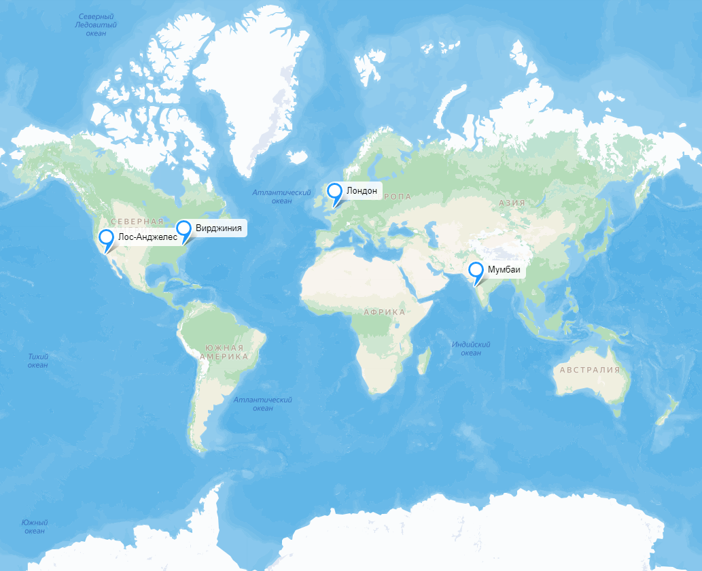

# Google Calendar

## 1. Тема и целевая аудитория

**Google Calendar** — сервис для планирования встреч, событий и дел.

### 1.1. Целевая аудитория

**MAU** = **500** млн. [[1]](https://explodingtopics.com/blog/google-workspace-stats), [[2]](https://zipdo.co/statistics/google-calendar/), [[4]](https://www.patronum.io/key-google-workspace-statistics-for-2023/)

Информация о **DAU** отсутствует, поэтому примем его, равным **500 млн.** пользователей, т.е. `MAU = DAU`, т.к. данный тип сервиса используется для планирования встреч, событий и дел, а также для синхронизации данных на устройствах. [[3]](https://marketsplash.com/google-workspace-statistics/)

### 1.2. Географическое распространение (данные за январь 2024) [[4]](https://www.similarweb.com/website/calendar.google.com/#geography)

| Страна         | Процент пользователей от общего числа, % | Количество, млн. |
| -------------- | :--------------------------------------: | :--------------: |
| США            |                  42,93                   |      214,65      |
| Япония         |                   8,17                   |      4,085       |
| Великобритания |                   3,68                   |       1,84       |
| Канада         |                   3,56                   |       1,78       |
| Франция        |                   3,43                   |      1,715       |
| Другие         |                  38,24                   |      191,2       |

### 1.3. Распространение среди различных возрастных групп (данные за январь 2024) [[4]](https://www.similarweb.com/website/calendar.google.com/#geography)

| Возрастная группа | Процент пользователей от общего числа, % |
| :---------------: | :--------------------------------------: |
|      18 - 24      |                  14,74                   |
|      25 - 34      |                  29,81                   |
|      35 - 44      |                  20,58                   |
|      45 - 54      |                  16,89                   |
|      55 - 64      |                  11,33                   |
|        65+        |                   6,65                   |

### 1.4. MVP

- Регистрация, авторизация;
- Создание, редактирование календарей;
- Каждый календарь можно сделать общедоступным либо предоставить отдельным людям доступ к нему (просмотр или редактирование) через приглашение по электронной почте;
- Уведомления о предстоящих событиях по почте;
- Создание и редактирование событий.

## 2. Расчёт нагрузки

### 2.1. Продуктовые метрики

#### 2.1.1. Хранилище пользователя

Базовый функционал этого приложения включает в себя следующие типы данных:

| Пользователь (профиль) | Календарь       | Событие в календаре | Уведомление                      | Ответ на уведомление | Напонимание                      | Подписка на календарь |
| ---------------------- | --------------- | ------------------- | -------------------------------- | -------------------- | -------------------------------- | --------------------- |
| email                  | Название        | Дата создания       | Календарь (ссылка)               | Ответ пользователя   | Календарь (ссылка)               | Календарь             |
| Хэшированный пароль    | Описание        | Дата обновления     | Владелец (ссылка)                |                      | Владелец (ссылка)                | Пользователь          |
| Имя и фамилия          | Дата создания   | Дата начала         | email приглашённого пользователя |                      | email приглашённого пользователя |                       |
| Часовой пояс           | Дата обновления | Дата окончания      | Событие (ссылка)                 |                      | Событие (ссылка)                 |                       |
| Телефонный номер       | Часовой пояс    | Название            | Ответ пользователя               |                      |                                  |                       |
|                        | Владелец        | Описание            |                                  |                      |                                  |                       |
|                        |                 | Календарь           |                                  |                      |                                  |                       |
|                        |                 | Пользователь        |                                  |                      |                                  |                       |

- Примем число личных календарей, равным `5` и число календарей, в которые пользователь может быть приглашён, равным `10`.
- Число пользователей, которых можно одномоментно пригласить в календарь примем равным `750` [[15]](https://support.google.com/a/answer/2905486?hl=en).
- Максимальное число пользователей, которых можно пригласить на событие примем равным `200` [[14]](https://support.google.com/calendar/answer/37161?hl=en&co=GENIE...&co=GENIE.Platform%3DDesktop#zippy=%2Cguest-limit-for-invitations).
- Число событий, создаваемым пользователем в день примем равным 3 (при общем числе событий в 1,5 млрд [[3]](https://marketsplash.com/google-workspace-statistics/) и DAU = 500 млн. число событий 1500/500 = 3) и хранятся 5 лет, поэтому за 5 лет у пользователя накопится 5 \* 365 \* 3 = `5475`.
- Все символы будут храниться в кодировке `UTF-8`, где каждый символ занимает около 3-х байт [[16]](https://stackoverflow.com/questions/10229156/how-many-characters-can-utf-8-encode).
- Полагаем, что максимально число событий, которые может создать пользователь не превышает `1000`.

Далее проведём подробный расчёт с целью выяснение необходимого места для одного пользователя на каждый из этих типов.

#### _Пользователь (профиль)_

| Тип данных          | Размер                                                                                                                                                                                                                                                              |
| ------------------- | ------------------------------------------------------------------------------------------------------------------------------------------------------------------------------------------------------------------------------------------------------------------- |
| email               | 255 B [[6]](https://emaillistvalidation.com/blog/demystifying-email-validation-understanding-the-maximum-length-of-email-addresses/#:~:text=Defining%20the%20Maximum%20Length&text=Domain%20Part%3A%20The%20domain%20part,email%20address%20is%20320%20characters.) |
| Хэшированный пароль | 72 B [[7]](https://cheatsheetseries.owasp.org/cheatsheets/Password_Storage_Cheat_Sheet.html)                                                                                                                                                                        |
| Имя и фамилия       | 300 B [[8]](https://www.geekslop.com/technology-articles/2016/here-are-the-recommended-maximum-data-length-limits-for-common-database-and-programming-fields#:~:text=35%20chars%20(US)%2C-,50%20(other),-Last%20name)                                               |
| Часовой пояс        | 8 B (ссылка)                                                                                                                                                                                                                                                        |
| Телефонный номер    | 60 B [[8]](https://www.geekslop.com/technology-articles/2016/here-are-the-recommended-maximum-data-length-limits-for-common-database-and-programming-fields#:~:text=35%20chars%20(US),-,50%20(other),-Last%20name)                                                  |
| Страна              | 165 B [[8]](https://www.geekslop.com/technology-articles/2016/here-are-the-recommended-maximum-data-length-limits-for-common-database-and-programming-fields#:~:text=35%20chars%20(US)%2C-,50%20(other),-Last%20name)                                               |
| Город               | 150 B [[8]](https://www.geekslop.com/technology-articles/2016/here-are-the-recommended-maximum-data-length-limits-for-common-database-and-programming-fields#:~:text=35%20chars%20(US)%2C-,50%20(other),-Last%20name)                                               |
| **Общий размер**    | 255 + 72 + 300 + 8 + 45 + 165 + 150 = `995 B`                                                                                                                                                                                                                       |

##### _Календарь_

| Тип данных        | Размер                                                                                   |
| ----------------- | ---------------------------------------------------------------------------------------- |
| Название          | 128 символов UTF-8 (384 B)                                                               |
| Описание          | 1024 символа UTF-8 (3076 B)                                                              |
| Дата создания     | 12 B [[9]](https://www.postgresql.org/docs/8.2/datatype-datetime.html)                   |
| Дата обновления   | 12 B                                                                                     |
| Часовой пояс      | 8 B (ссылка)                                                                             |
| Владелец (ссылка) | 8 B                                                                                      |
| **Общий размер**  | 5 \* (372 + 3076 + 8 + 12 + 12 ) = 5 \* 3492 = 17460 B < `17.5 KiB` (принимаем 17.5 KiB) |

##### _Событие_

| Тип данных             | Размер                                                                                                                         |
| ---------------------- | ------------------------------------------------------------------------------------------------------------------------------ |
| Дата создания          | 12 B                                                                                                                           |
| Дата обновления        | 12 B                                                                                                                           |
| Дата начала            | 12 B                                                                                                                           |
| Дата окончания         | 12 B                                                                                                                           |
| Название               | 128 символов UTF-8 (384 B)                                                                                                     |
| Описание               | 1024 символа UTF-8 (3072 B)                                                                                                    |
| Календарь              | 8 B (ссылка)                                                                                                                   |
| Пользователь           | 8 B (ссылка)                                                                                                                   |
| Рекуррентность события | 1 B (bool)                                                                                                                     |
| Период создания        | 12 B                                                                                                                           |
| **Общий размер**       | 5475 \* (12 + 12 + 12 + 12 + 372 + 3072 + 8 + 8 + 12 + 1 + 12) = 5475 \* 3545 = 19 408 875 B < `19.4 MiB` (принимаем 19.4 MiB) |

##### _Уведомление_

| Тип данных       | Размер                                                                         |
| ---------------- | ------------------------------------------------------------------------------ |
| Событие          | 8 B (ссылка)                                                                   |
| Время события    | 12 B                                                                           |
| **Общий размер** | 1000 \* (8 + 255 + 1) = 1000 \* 264 = 264000 B < `264 KiB` (принимаем 264 KiB) |

##### _Ответ на уведомление_

| Тип данных                   | Размер                                                                             |
| ---------------------------- | ---------------------------------------------------------------------------------- |
| email пользователя           | 255 B                                                                              |
| Ответ пользователя           | 1 B (uint_8t)                                                                      |
| Событие                      | 8 B (ссылка)                                                                       |
| Время до события напоминания | 12 B                                                                               |
| **Общий размер**             | 200 \* (255 + 1 + 8 + 12) = 200 \* 276 = 55200 B < `55.2 KiB` (принимаем 55.2 KiB) |

##### _Напоминание_

| Тип данных                   | Размер                                                                |
| ---------------------------- | --------------------------------------------------------------------- |
| Время до напоминания события | 12 B                                                                  |
| Событие                      | 8 B (ссылка)                                                          |
| **Общий размер**             | 1000 \* (8 + 12) = 1000 \* 20 = 20000 B < `20 KiB` (принимаем 20 KiB) |

##### _Подписка на календарь_

| Тип данных       | Размер                             |
| ---------------- | ---------------------------------- |
| Календарь        | 8 B (ссылка)                       |
| Пользователь     | 8 B (ссылка)                       |
| **Общий размер** | 10 \* (8 + 8) = 10 \* 16 = `160 B` |

##### _Размер хранилища_

| Тип                    |                   Размер хранилища                    |
| ---------------------- | :---------------------------------------------------: |
| Пользователь (профиль) |                         995 B                         |
| Календари              |                         6 KiB                         |
| Подписки на календари  |                         160 B                         |
| События                |                       19.4 MiB                        |
| Напоминания            |                        20 KiB                         |
| **Общий размер**       | 995 B + 6 KiB + 160 B + 19.4 MiB + 4 MiB < `19.5 MiB` |

- Общий размер здесь проведён приближённо, для оценки размера хранилища.

### 2.2 Технические метрики

#### 2.2.1 Размер хранения по типам данных

Т.к. количество зарегистрированных аккаунтов в Google Workspace равно 3 млрд [[1]](https://explodingtopics.com/blog/google-workspace-stats)-[[4]](https://www.patronum.io/key-google-workspace-statistics-for-2023/) и, учитывая, что Calendar создаётся для каждого пользователя, примем количество зарегистрированных пользователей равным 3 млрд.

Для расчёта хранилища учтём, что календари есть у всех пользователей, а события и история изменений актуальны лишь для активных пользователей.

| Тип                    |          Размер хранилища          |
| ---------------------- | :--------------------------------: |
| Пользователь (профиль) |   995 B \* 3 млрд. = `2.715 TiB`   |
| Календари              |  6 KiB \* 3 млрд. = `16.763 TiB`   |
| Подписки на календари  |  160 B \* 3 млрд. = `447.035 GiB`  |
| События                | 19.4 MiB \* 500 млн. = `9.034 PiB` |
| Напоминания            |  20 KiB \* 500 млн. = `9.313 TiB`  |

#### 2.2.1 Сетевой трафик

#### Формулы расчёта

1. Средний RPS

   `DAU * количество действий * количество запросов для действия / 86400 сек`

2. Средний суточный трафик:

   `DAU * количество действий * количество байт пересылаемых запросами для совершения действия / 86400 сек`

#### Количество событий в сутки

Для определения необходимых метрик требуется установить количество событий на каждый из типов данных, поэтому приведём их в таблице ниже.

**Допущения**

- Каждый пользователь может отменить подписку на события, но для расчёта примем, что у всех пользователей подписка есть.
- Также примем, что из календаря приходит до 10 уведомлений в день.

| Тип события                  | Количество действий в день |
| ---------------------------- | -------------------------- |
| Просмотр календарей          | 5 + 10 = `15`              |
| Взаимодействия с календарями | `3`                        |
| Получение уведомлений        | 10 \* 15 = `150`           |

#### Количество запросов и количество пересылаемых данных

Также для расчёта технических метрик необходимо знать количество пересылаемых данных, которые определим из соображений ниже.

- Просмотр календарей, кроме `запроса на получение данных самого календаря`, включает `запрос на получение данных пользователя`, поэтому `суммарное количество запросов` равно (1 + 1 ) \* 15 = `30`, а количество данных равно соответственно 3545 \* 15 = `53175 B`.
- Взаимодействие с календарями включает лишь создание/обновление события, поэтому `суммарное количество запросов` равно `3`, а количество данных равно соответственно 3 \* 3545 = `10635 B`.
- Получение уведомлений включает лишь один запрос, поэтому суммарное `количество запросов на получение уведомлений` равно `150`, т.е. `количеству действий в день`, а количество данных уведомления соответственно данным о событии, т.е. получим 150 \* 3545 = `182400 B`.

#### Расчёт метрик

| Тип метрики                  | RPS                                    | Средний суточный трафик                            |
| ---------------------------- | -------------------------------------- | -------------------------------------------------- |
| Просмотр календарей          | 500 млн. \* 45 / 86400 сек = `260417`  | 500 млн. \* 45 \* 69300 / 86400 = `144.375 Гбит/с` |
| Взаимодействия с календарями | 500 млн. \* 3 / 86400 сек = `17362`    | 500 млн. \* 3 \* 3684 / 86400 = `511.6 Мбит/с`     |
| Получение уведомлений        | 500 млн. \* 150 / 86400 сек = `868056` | 500 млн. \* 150 \* 182400 / 86400 = `1.26 Тбит/с`  |

#### Полученные значения метрик

Для получения пиковых значений RPS и трафика умножим среднее потребление трафика в два раза (возьмём коэффициент запаса, равный 2-м).

| Действие                     |  RPS   | Пиковый RPS | Средний трафик |  Пиковый трафик  |
| ---------------------------- | :----: | :---------: | :------------: | :--------------: |
| Просмотр календарей          | 260417 |   520834    | 144.375 Гбит/с | 288.750 Гбит/сек |
| Взаимодействия с календарями | 17362  |    34724    |  511.6 Мбит/с  | 1023.2 Мбит/сек  |
| Получение уведомлений        | 868056 |   1736112   |  1.26 Тбит/с   |  2.52 Тбит/сек   |

## 3. Глобальная балансировка нагрузки

### 3.1. Физическое расположение дата-цетров

Для анализа основных регионов потоков трафика были выбраны следующие статистики:

|     Страна     | hypestat.com [[11]](https://hypestat.com/info/calendar.google.com) | webstatsdomain.org [[12]](https://webstatsdomain.org/d/calendar.google.com) | similarweb.com [[5]](https://www.similarweb.com/website/calendar.google.com/#geography) |
| :------------: | :----------------------------------------------------------------: | :-------------------------------------------------------------------------: | :-------------------------------------------------------------------------------------: |
|      USA       |                               18.8%                                |                                    32.7%                                    |                                         42.93%                                          |
|     India      |                               10.7%                                |                                    7.7%                                     |                                            —                                            |
|     China      |                                 —                                  |                                    4.4%                                     |                                            —                                            |
|     Japan      |                                5.2%                                |                                    4.3%                                     |                                          8.17%                                          |
| United Kingdom |                                 —                                  |                                      —                                      |                                          3.68%                                          |
|     Canada     |                                 —                                  |                                      —                                      |                                          3.56%                                          |
|     Russia     |                                2.9%                                |                                      —                                      |                                            —                                            |
|     France     |                                 —                                  |                                      —                                      |                                          3.43%                                          |
|     Brazil     |                                2.8%                                |                                      —                                      |                                            —                                            |
|      Iran      |                                 3%                                 |                                      —                                      |                                            —                                            |

Similarweb.com был выбран, несмотря на свою неточность для обобщения с остальными статистиками, т.к. это позволит увеличить выборку.

Обобщим эти статистики (Китай был исключён из этой выборки ввиду особенностей доступности и использования в нём иностранных сервисов):

1. USA — 42.93%
2. India — 10.7%
3. Japan — 8.17%
4. United Kingdom — 3.68%
5. Canada — 3.56%
6. France — 3.43%
7. Iran — 3%
8. Russia — 2.9%
9. Brazil — 2.8%
10. Other — 25.26%

Исходя их этой статистики можно сделать вывод, что основная часть дата-центров должна располаться в США, остальные — региональные.

Возможные города распложения дата-центров возьмём из [[13]](https://www.visualcapitalist.com/cp/top-data-center-markets/).

Для анализа возможного расположения дата-центров учтём то, что факт задержки (Latency) не важен для данного сервиса, поэтому лучше выбрать немного дата-центров, но сделать их максимально надёжными. Следовательно, их необходимо располагать в городах, в которых находятся наиболее крупные дата-центры (это можно сделать, анализируя, например, их энергопотребление) и максимально близкими к основной аудитории.

Из вышесказанного следует, что дата-центры будут расположены следующим образом:

- Основные дата-центры в США:
  - Вирджиния (Северо-восток)
  - Лос-Анджелес (Юго-запад)
- Дополнительные дата-центры:
  - Индия (Мумбаи)
  - Германия (Франкфурт)

Расположение в США двух дата-центров обосновано тем, что США — основной потребитель трафика подобного сервиса, в Индии — потому что следующим регионом по аудитории данного сервиса после США является Индрия, а в Лондоне, который является очень крупным хабом для датацентров Европы, — для обеспечения покрытия Европы, которая суммарно составляет также крупный регион потребления трафика.

#### Карта физического расположения дата-центров

Ссылка на карту (https://yandex.ru/maps/?um=constructor%3Aaea556dba6be4bcec4779f984ed8f4823e591b580d93639704395d6a6a3eb012&source=constructorLink)

### 3.2 Алгоритм балансировки

Отсюда можно заключить, что наиболее целесообразно будет использовать следующие технологии:

- `BGP Anycast`
- `Geo-based DNS`

Выбор `BGP Anycast` обоснован тем, что пользователя будет направлять в оптимальный по расположению дата-центр (с точки зрения BGP), т.к. позволяет распределить нагрузку между отдельными регионами с помощью настройки anycast-сетей, которая позволит гранулярно "отправлять" пользователей в различные дата-центры. Использование `Geo-based DNS` целессобразно для разграничения пользователей по регионам с помощью настройки `GeoIP-базы`, что может использоваться для персонализации контента, например, региональной рекламы.

Также откажемся технологий:

- `Latency-based DNS`
- `Использование CDN в качестве хаба для обеспечения более стабильного соединения`

Как уже было сказано, задержка (Latency) для данного сервиса не важна, поэтому `Latency-based DNS` здесь не имеет смысл. `Использование CDN в качестве хаба для обеспечения более стабильного соединения` не нужен, т.к. нет необходимости в стабильном и качественном подключении для создания событий календаря.

## 4. Локальная балансировка нагрузки

## Список использованных источников

1. https://explodingtopics.com/blog/google-workspace-stats
2. https://zipdo.co/statistics/google-calendar/
3. https://marketsplash.com/google-workspace-statistics/
4. https://www.patronum.io/key-google-workspace-statistics-for-2023/
5. https://www.similarweb.com/website/calendar.google.com/#geography
6. https://emaillistvalidation.com/blog/demystifying-email-validation-understanding-the-maximum-length-of-email-addresses/#:~:text=Defining%20the%20Maximum%20Length&text=Domain%20Part%3A%20The%20domain%20part,email%20address%20is%20320%20characters.
7. https://cheatsheetseries.owasp.org/cheatsheets/Password_Storage_Cheat_Sheet.html
8. https://www.geekslop.com/technology-articles/2016/here-are-the-recommended-maximum-data-length-limits-for-common-database-and-programming-fields#:~:text=35%20chars%20(US)%2C-,50%20(other),-Last%20name
9. https://www.postgresql.org/docs/8.2/datatype-datetime.html
10. https://stackoverflow.com/questions/24138581/what-is-the-maximum-allowed-expiration-time-for-a-google-notification-channel
11. https://hypestat.com/info/calendar.google.com
12. https://webstatsdomain.org/d/calendar.google.com
13. https://www.visualcapitalist.com/cp/top-data-center-markets/
14. https://support.google.com/calendar/answer/37161?hl=en&co=GENIE...&co=GENIE.Platform%3DDesktop#zippy=%2Cguest-limit-for-invitations
15. https://support.google.com/a/answer/2905486?hl=en
16. https://stackoverflow.com/questions/10229156/how-many-characters-can-utf-8-encode
